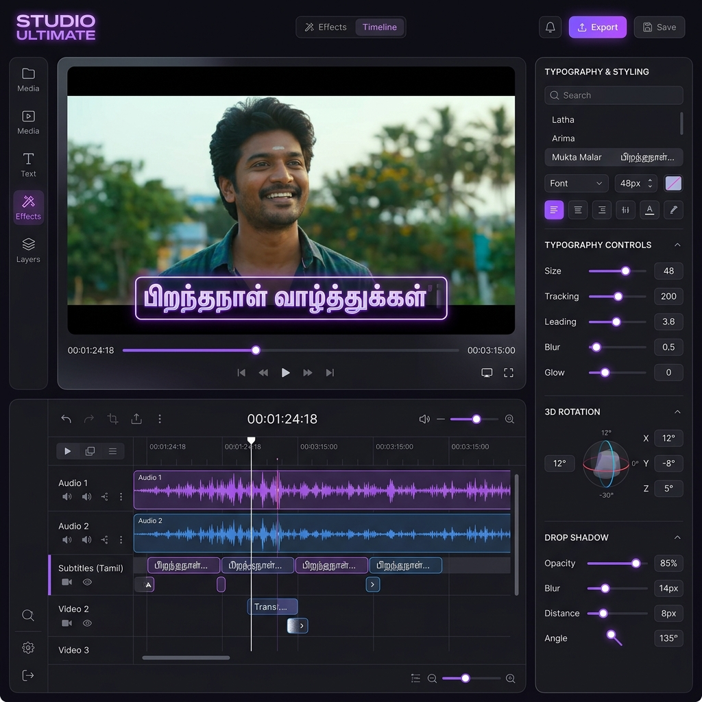
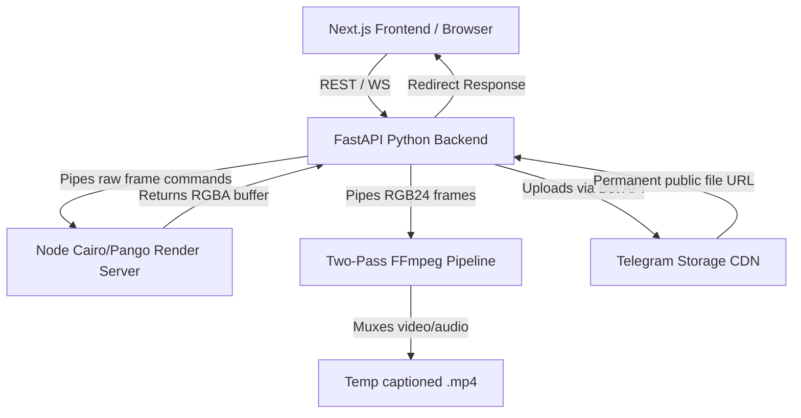

# Studio Ultimate 🎬

**Studio Ultimate** is a next-generation, AI-powered video captioning and editing web application. It automates video transcription, aligns subtitles, applies premium custom typography styles (including strokes, glows, 3D rotations, and gradient fills), and burns them directly into exported videos.



---

## 🏗️ System Architecture

Studio Ultimate is built using a highly decoupled, multi-runtime architecture designed to handle intensive video rendering tasks reliably and without local storage state constraints.



1.  **Frontend (Next.js & React)**:
    *   A sleek, dark-themed dashboard built with custom CSS.
    *   Interactive canvas interface providing instant, real-time feedback on text style manipulations (glows, shadows, borders, 3D tilt).
2.  **Backend (FastAPI & Python)**:
    *   Orchestrates the dewarping computer vision pipeline, subtitle databases, and the background export tasks.
3.  **Subtitle Canvas Render Server (Node.js & Cairo/Pango)**:
    *   Runs persistently alongside the backend. It uses `node-canvas` and system-native font shaping libraries (Pango) to rasterize styled Indic (Tamil) subtitles pixel-for-pixel identically to the browser preview.
4.  **Two-Pass FFmpeg Pipeline**:
    *   **Pass 1**: Python pipes raw video frames through stdin to FFmpeg to encode a silent, captioned intermediate video. This isolates the frame loop and guarantees no early pipe termination (crashes).
    *   **Pass 2**: A quick second pass muxes the original audio track back onto the video.
5.  **Telegram Bot Storage CDN**:
    *   Acts as a free, unlimited cloud file system. Exported videos are automatically uploaded to Telegram via Bot API, and subsequent client downloads are redirected to the Telegram CDN.

---

## ✨ Features

*   **Complex Script Ligature Support**: Perfect rendering of Tamil character ligatures on Windows systems using custom fallback mapping to `"Nirmala UI"`.
*   **3D Text Customization**: Fine-grained text decoration options including gradient colors, custom borders, drop shadows, glow layers, and 3D rotations along X, Y, and Z axes.
*   **Computer Vision Video Dewarping**: Automatic vertical video stretch ratio analysis using OpenCV ellipse-fitting contours, correcting aspect-ratio distortions.
*   **Stateless Hosting Optimization**: Fully compatible with Vercel and Render free tiers; all storage is offloaded to Telegram to prevent local file loss when servers sleep.

---

## 🚀 Setup & Installation

### Prerequisite Environment Configuration (`.env`)
Create a `.env` file in the root folder:
```env
SMTP_HOST=smtp.gmail.com
SMTP_PORT=587
SMTP_USER=your_email@gmail.com
SMTP_PASS=your_smtp_app_password

TELEGRAM_BOT_TOKEN=8948595137:AAHeK1Xuz2DmgD1FfHF-mDUqD-KlRINt5Ho
# Optional: TELEGRAM_CHAT_ID=-100xxxxxxxx
```

### 1. Running the FastAPI Backend
```bash
# Navigate to project root, install Python requirements
pip install -r requirements.txt

# Start the development server
uvicorn api.main:app --host 0.0.0.0 --port 8000 --reload
```

### 2. Running the Next.js Frontend
```bash
# Install dependencies
npm install

# Start the frontend in development mode
npm run dev
```
Open [http://localhost:3000](http://localhost:3000) to access **Studio Ultimate**.
