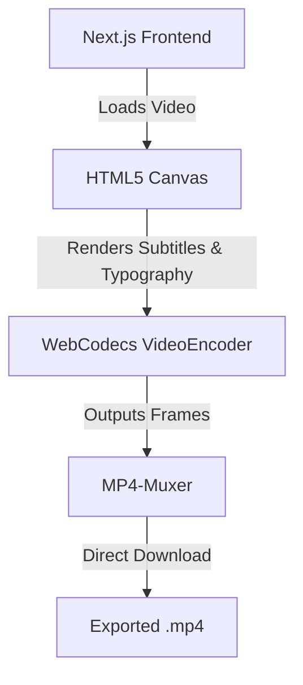

# Studio Ultimate 🎬

🌐 **Live Demo:** [https://invincible-studios-captions.vercel.app/](https://invincible-studios-captions.vercel.app/)

**Studio Ultimate** is a next-generation, AI-powered video captioning and editing web application. It automates video transcription, aligns subtitles, applies premium custom typography styles (including strokes, glows, 3D rotations, and gradient fills), and burns them directly into exported videos.


---

## 🏗️ System Architecture & Vibe Coding

Studio Ultimate is proudly built with **vibe coding**. It relies on modern web technologies to handle intensive video rendering tasks reliably and directly within your browser, with absolutely zero backend dependencies for export.



1.  **Frontend (Next.js & React 19)**:
    *   A sleek, dark-themed dashboard built with custom CSS.
    *   Interactive canvas interface providing instant, real-time feedback on text style manipulations (glows, shadows, borders, 3D tilt).
2.  **100% Client-Side Export (WebCodecs)**:
    *   No backend required. Video rendering runs entirely offline in the browser using the `requestVideoFrameCallback` API and WebCodecs `VideoEncoder`.
    *   Lightning fast, robust, and completely free from server timeouts or bandwidth limitations.

---

## ✨ Features

*   **Complex Script Ligature Support**: Perfect rendering of Tamil character ligatures on Windows systems using custom fallback mapping to `"Nirmala UI"`.
*   **3D Text Customization**: Fine-grained text decoration options including gradient colors, custom borders, drop shadows, glow layers, and 3D rotations along X, Y, and Z axes.
*   **Zero Server Costs**: Fully compatible with Vercel and Render free tiers; all video processing is offloaded to the user's browser CPU/GPU via WebCodecs.

---

## 🚀 Setup & Installation

### 1. Running the Next.js Frontend
```bash
# Install dependencies
npm install

# Start the frontend in development mode
npm run dev
```
Open [http://localhost:3000](http://localhost:3000) to access the local development environment, or visit the live deployment at [https://invincible-studios-captions.vercel.app/](https://invincible-studios-captions.vercel.app/).

